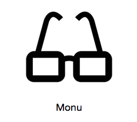
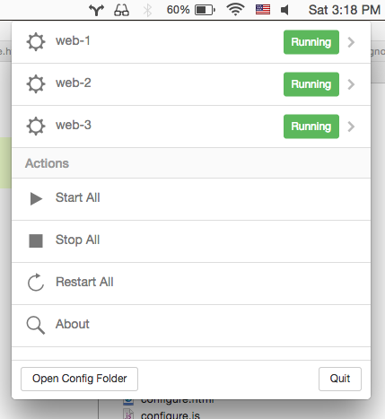

### Monu



Monu is an open source process monitoring menu bar application for Mac OS. You can configure Monu to launch programs, and when Monu starts up it will start them. Additionally, it will monitor the processes and restart them if they crash.

Monu is a portmanteau of 'monitor' and 'menu'. It has two C/C++ dependencies, [Atom Shell](https://github.com/atom/atom-shell) (which includes iojs) and the [mon](https://github.com/tj/mon) process monitor.

Monu is currently **ALPHA STATUS** and is intended for developers/early adopters.

To download the latest version visit the [releases page](https://github.com/maxogden/monu/releases)

[](https://github.com/feross/standard)

[](https://travis-ci.org/maxogden/monu)



##### How to use Monu

To configure Monu, click 'Open Config Folder' and open 'config.json' in a text editor. When you save and return to Monu your new configuration will be automatically loaded.

Be sure your JSON syntax is valid when editing the configuration. Here are supported options. These should be added as top level key/value pairs to 'config.json':

<ul>
  <li><b>processes</b> the processes to run (see below)</li>
  <li><b>logs</b> the directory to store logs in (default config/pids)</li>
  <li><b>pids</b> the directory to store PIDs in (default config/logs)</li>
  <li><b>on-error</b> a command to run when a process cannot start (default none)</li>
  <li><b>on-restart</b> a command to run when a process restarts (default none)</li>
  <li><b>sleep</b> sleep seconds before re-executing (default 1)</li>
  <li><b>attempts</b> restart attempts within 60 seconds before stopping app (default 10)</li>
  <li><b>prefix</b> add a string prefix to the log (default none)</li>
</ul>

##### Adding Processes

In the 'config.json' file add processes to the 'processes' key. The key must be a name (lowercase letters and hypens) and the value must be the launch command. For example:

```json
{
  "logs": "./logs",
  "pids": "./pids",
  "processes": {
    "web-1": "http-server . -p 8081",
    "web-2": "http-server . -p 8082",
    "web-3": "http-server . -p 8083"
  }
}
```

##### Launch on Startup

When you open Monu.app, it will start all configured processes.

If you would like Monu.app to start when your Mac starts up, got to <b>System Preferences &gt; Users and Groups</b> and add Monu.app to <b>Login Items</b> for your User.

##### Developing

```bash
npm install # installs atom-shell and all the deps needed for monu
npm run app # runs the app in the atom-shell wrapper
npm run build # builds the mac app
```

##### Publishing

Before publishing, make sure that your repo is clean, and that you've created a tag for the latest commit. `npm version [major|minor|patch]` will do this for you, increasing the package.json version, creating a commit and adding a tag.

You should see something like this:

```
🐈  make publish
rm -rf Monu.app Monu.zip # prevent duplicates in the final bundle
npm run build

> monu@1.0.4 build /Users/maxogden/src/js/monu
> atom-shell-packager . Monu --ignore=node_modules/atom-shell

Wrote new app to /Users/maxogden/src/js/monu/Monu.app
ditto -c -k --sequesterRsrc --keepParent Monu.app Monu.zip
npm run publish

> monu@1.0.4 publish /Users/maxogden/src/js/monu
> publish-release --template notes.md --assets Monu.zip

? Git Tag: v1.0.4
? Github repository owner: maxogden
? Github repository name: monu
? Release Name: Monu v1.0.4 Alpha

Uploading Monu.zip
[=================================================>] 100.0% (1.17 MB/s)
Done! Published at: https://github.com/maxogden/monu/releases/tag/v1.0.4
```
